# Online Book Shopping - Web Application

<!-- ALL-CONTRIBUTORS-BADGE:START - Do not remove or modify this section -->

<!-- ALL-CONTRIBUTORS-BADGE:END -->

## Overview

This is a web-based online book shopping platform. There are two end users exist in the system: admin and customer. Both admin and customer have their own portals. Admin is only allowed to access admin portal, while customer is only allowed to access customer portal.

## Features

1. Register as Customer 
   The user can register as customer to shop the online book platform.

2. Login 
   The user who have registered or admin can log in to the system using their username and password.

### Admin Features

1. Add Book 
   The admin can add the book by entering the book details such as book title, author, category, stock, price and cover.

2. Update Book 
   The admin can update the book by selecting the book and entering the new details of the book.

3. View Book 
   The admin can view all the books added to the system. Besides, the admin can also search book by book title or author, filter or sort the book list.

4. Delete Book 
   The admin can delete the book by selecting the book and confirm the book deletion.

5. View Transaction History 
   The admin can view all the order transactions of the customers. Besides, the admin can filter or sort the transaction list.

### Customer Features

1. View Book 
   The customer can view all the available books. Besides, the admin can also search book by book title or author, filter or sort the book list.

2. Purchase Book 
   The customer can purchase the book by selecting the book and quantity to purchase. The maximum book quantity to purchase is the stock of the book, the customer cannot select the quantity more than the stock.

3. View Transaction History 
   The customer can view the transaction history of their purchases. They can also filter or sort the transactions.

## Tech Stack

- Java 8
- Servlet
- JSP
- HTML
- CSS
- JavaScript
- Oracle DB via JDBC
- Apache Tomcat 9.0

## System Design

The system follows the MVC design pattern.

- JSP, HTML, JavaScript and CSS act as the View.
- Servlet acts as the Controller.
- Data Access Object (DAO) and java bean act as the Model.

## Preview

1. Home Page   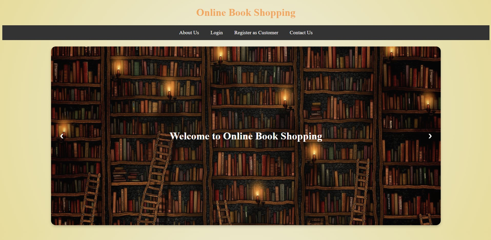  
2. About Us   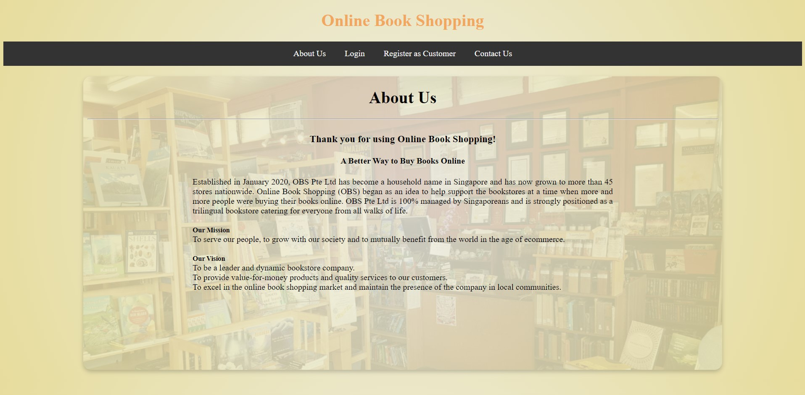  
3. Contact Us   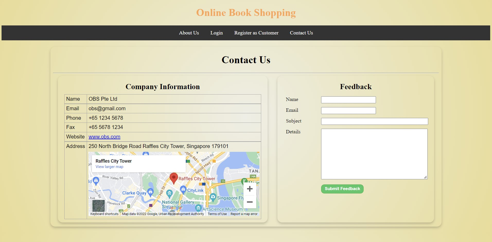  
4. Login   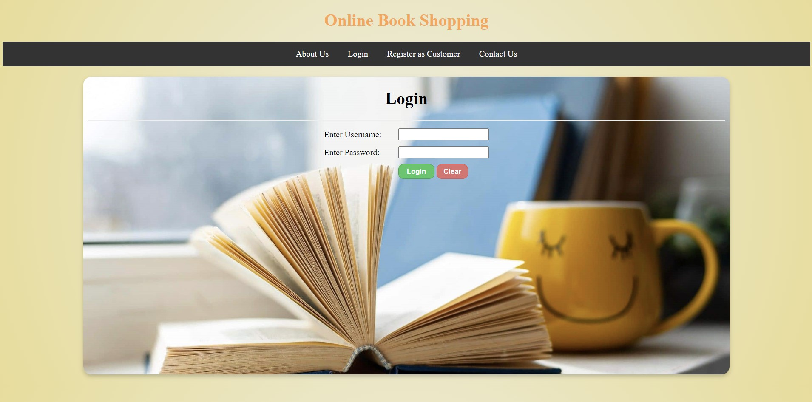  
5. Register as Customer  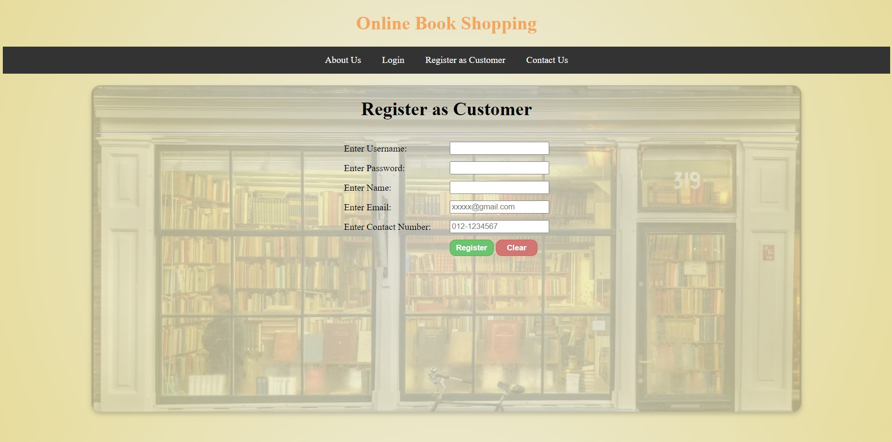  

### Admin

1. Home Page     
2. Add Book   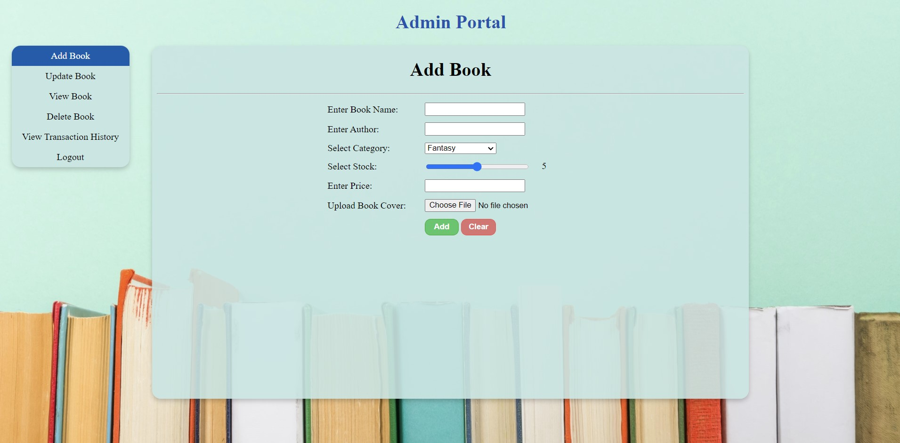  
3. Update Book   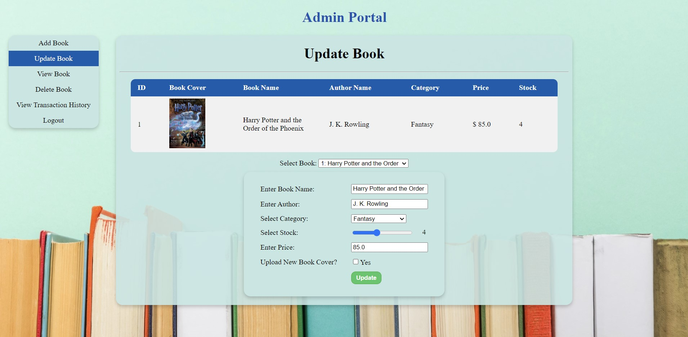  
4. View Books   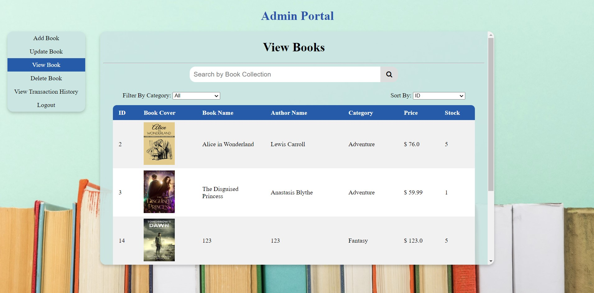  
5. Delete Book   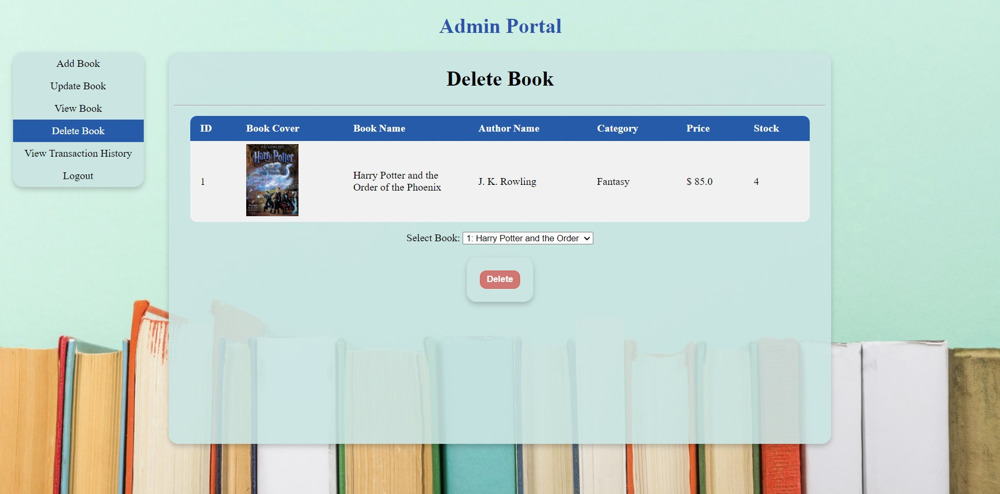  
6. View Transaction History   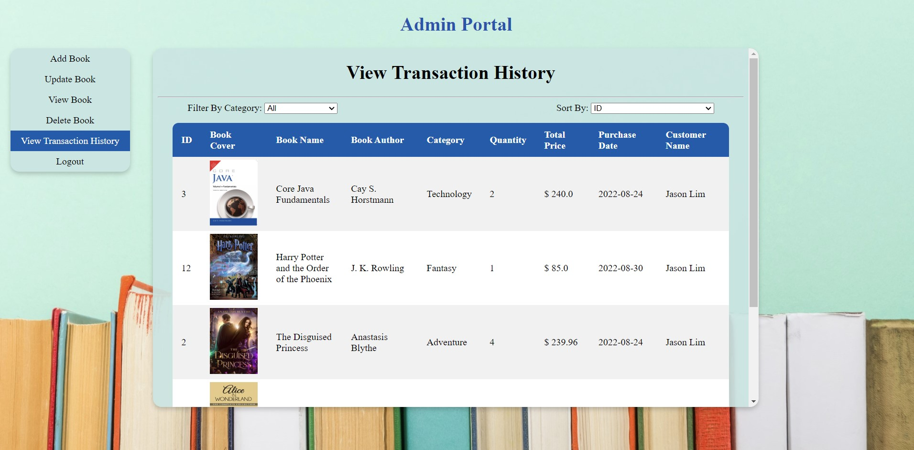  

### Customer

1. Home Page   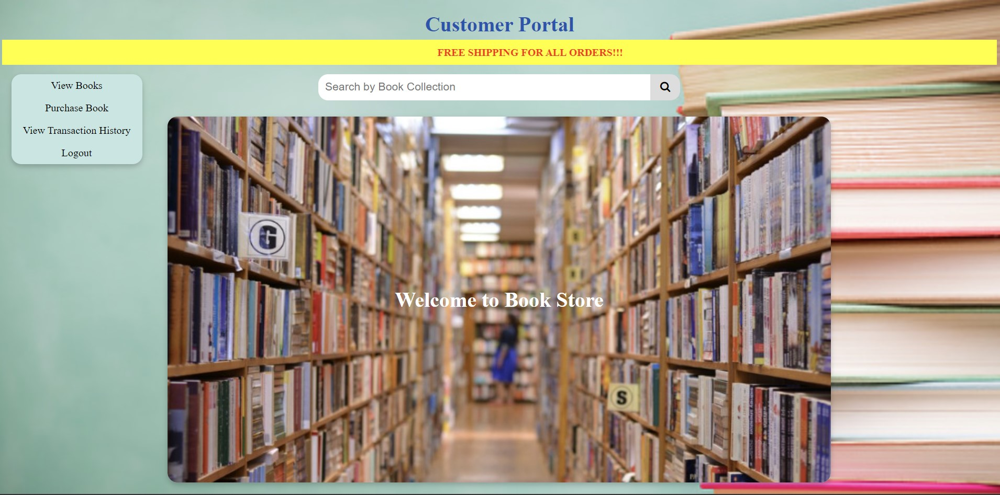  
2. View Books   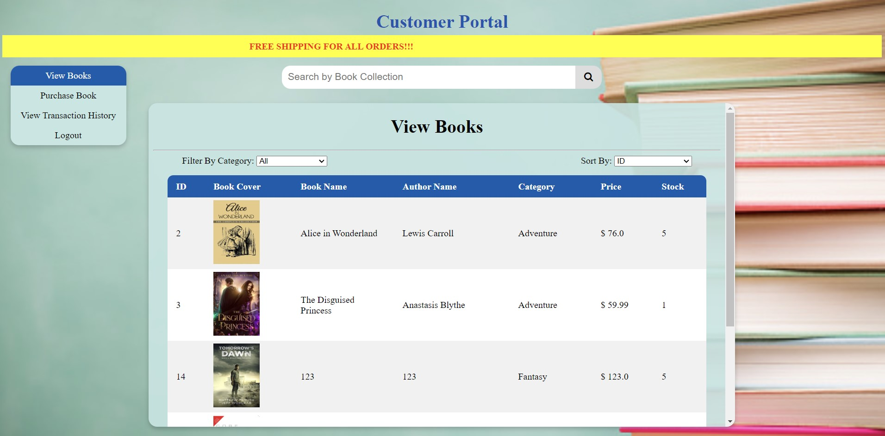  
3. Purchase Book   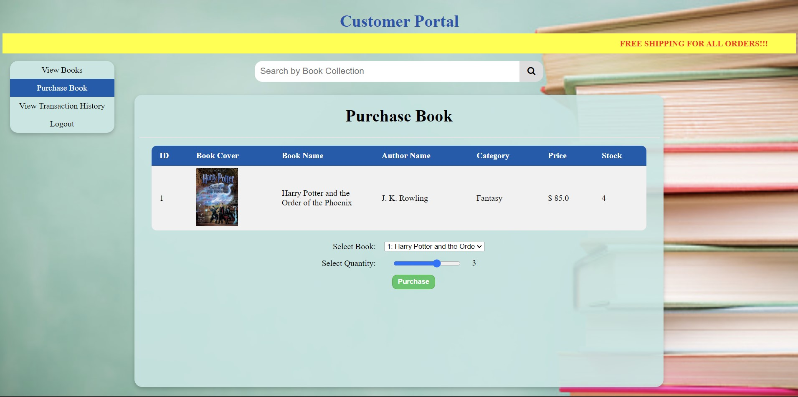  
4. View Transaction History   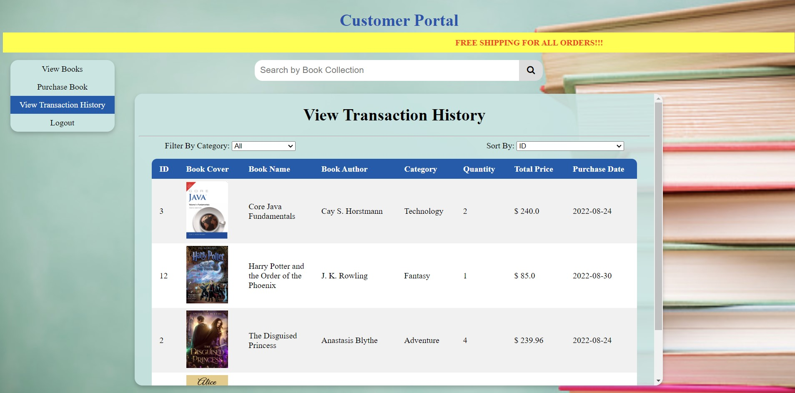  

## Contributors ✨

Thanks goes to these wonderful people ([emoji key](https://allcontributors.org/docs/en/emoji-key)):

<!-- ALL-CONTRIBUTORS-LIST:START - Do not remove or modify this section -->
<!-- prettier-ignore-start -->
<!-- markdownlint-disable -->
<table>
  <tr>
    <td align="center"><a href="https://github.com/yuanjie8629"> <b>Tan Yuan Jie</b></a> <a href="#question-yuanjie8629" title="Answering Questions">💬</a> <a href="https://github.com/yuanjie8629/OnlineBookShopping/commits?author=yuanjie8629" title="Code">💻</a> <a href="#content-yuanjie8629" title="Content">🖋</a> <a href="#data-yuanjie8629" title="Data">🔣</a> <a href="#design-yuanjie8629" title="Design">🎨</a> <a href="https://github.com/yuanjie8629/OnlineBookShopping/commits?author=yuanjie8629" title="Documentation">📖</a> <a href="#ideas-yuanjie8629" title="Ideas, Planning, & Feedback">🤔</a> <a href="#infra-yuanjie8629" title="Infrastructure (Hosting, Build-Tools, etc)">🚇</a> <a href="#maintenance-yuanjie8629" title="Maintenance">🚧</a> <a href="#tool-yuanjie8629" title="Tools">🔧</a></td>
  </tr>
</table>

<!-- markdownlint-restore -->
<!-- prettier-ignore-end -->

<!-- ALL-CONTRIBUTORS-LIST:END -->

This project follows the [all-contributors](https://github.com/all-contributors/all-contributors) specification. Contributions of any kind welcome!
